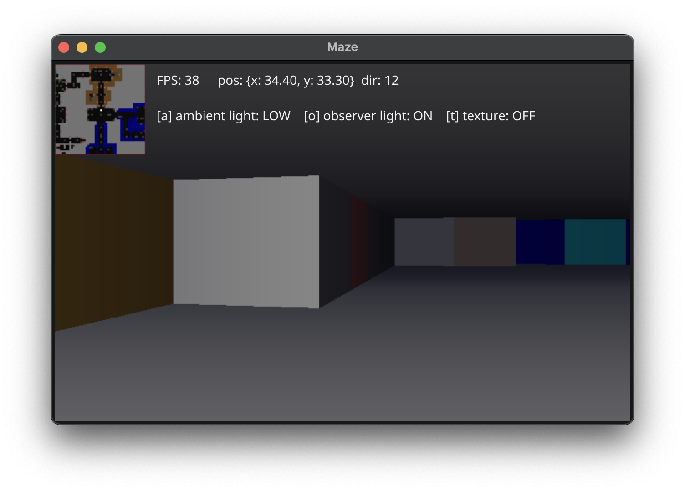

= Wolfenstein Raycaster

A raycasting engine with ambient light, dynamic observer light source.

The map and textures are from the mother of all first-person-shooter game Wolfenstein 3D. Wolfenstein 3D was groundbreaking in 3D using raycasting for low performance machines (by today's measures).

== How to compile and run

This raycaster is made in Go (Golang) and use the UI library Fyne for window and image display.

To compile this application using go you need to first install Fyne.
Installation instructions are found at their https://docs.fyne.io/started/[website].

Then type +
`go build -o wolfensteinmaze cmd/main.go` +
to build the executable binary.

Or run the application immediately by: +
`go run cmd/main.go`

== Raycasting à la Wolfenstein

An excellent source of information on raycasting can be found on https://lodev.org/cgtutor/raycasting.html[Lode's Computer Graphics Tutorial
 - Raycasting].

I have written my own summary on the link:documentation/raycasting.adoc[raycasting principle and algorithm].

=== Example video

A quick run through the maze and some final toggles of the rendering options for lights and textures.

.Raycasting maze video at Vimeo
[link=https://vimeo.com/1042705141]

=== Example screenshots

Screenshots from running the maze using map (level 0) and textures from Wolfenstein 3D.

[cols="0,1,2"]
|===
| Render option | Valid values | Description

| Ambient | LOW, FULL, OFF | The omnidirectional surrounding lighting. The always-surrounding light level if you like.
| Observer light | ON, OFF, ANIMATED | The dynamic light originating from the observer running the maze. When animated, the light is supposed to look like a light coming from a burning torch.
| Texture | ON, OFF | Using textures from Wolfenstein 3D. When OFF, the color used for the wall is the mean color of the texture.
|===

NOTE: The vertical red line in the middle, when using textures, is intentional and marks the middle pixel column of the screen/viewport. It is useful when running the maze and see where you are heading and aiming for.

NOTE: The FPS (frames per second) counter show a relative low frame count.
That is because I use the Fyne UI library to show the rendered frames/images.
Fyne is *not* aimed to be a game render library but a common application UI.

.Render settings: ambient=full, dynamic light (observer)=off, texture=on. (This is the rendering that is most true to the original game that could only use a 256-color palette.)
[link=documentation/images/maze-ambient_full-dynamic_off-texture_on.png]

.Render settings: ambient=low, dynamic light (observer)=off, texture=off.
[link=documentation/images/maze-ambient_low-dynamic_off-texture_off.png]

.Render settings: ambient=full, dynamic light (observer)=off, texture=off.
[link=documentation/images/maze-ambient_full-dynamic_off-texture_off.png]

.Render settings: ambient=low, dynamic light (observer)=on, texture=off.
[link=documentation/images/maze-ambient_low-dynamic_on-texture_off.png]

.Render settings: ambient=low, dynamic light (observer)=off, texture=on.
[link=documentation/images/maze-ambient_low-dynamic_off-texture_on.png]

.Render settings: ambient=low, dynamic light (observer)=on, texture=on.
[link=documentation/images/maze-ambient_low-dynamic_on-texture_on.png]

== Wolfenstein 3D map

Information on how the Wolfenstein 3D map data is stored, structured and parsed can be found on the link:documentation/wolfensteinmap.adoc[Wolfenstein map] page.

.A map generated from the level data of Wolfenstein 3D (level 0)
[link=documentation/wolfenstein3d-map-level0.png]

To regenerate the map image, activate the test `TestPaintWolfensteinMap` (remove the skip-test call at the start of the test) and then run the test. +
`$ go test -run TestPaintWolfensteinMap ./...`

You can also generate a map at the console using the test `TestPrintWolfensteinMap` (remove the skip-test call at the start of the test) and then run the test. +
`$ go test -run TestPrintWolfensteinMap ./...`
