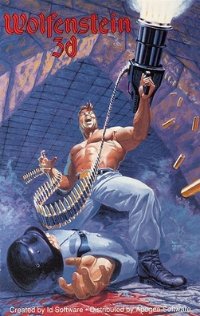
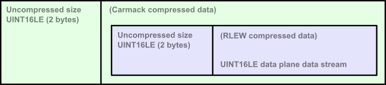

= Wolfenstein 3D map
:toc:
:toclevels: 3

In the package `wolf3d` of this project I have implemented a level map parser for the original map data of Wolfenstein 3D.

It is only parsing of the map data itself. That is the location of walls, doors, locations of items and enemies et.c.), and not the sprites or textures. I did not have the time nor the interest to parse the textures.

The textures are, however, supplied as resources in the package.

== Wolfenstein 3D, and other look alikes

.Cover art of the mail order DOS version


[quote,Wikipedia,Wolfenstein 3D]
Wolfenstein 3D is a first-person shooter video game developed by id Software and published by Apogee Software and FormGen. Originally released on May 5, 1992, for DOS. +
https://en.wikipedia.org/wiki/Wolfenstein_3D[Wikipedia]

== Map data, a quick overview

Wolfenstein 3D have 9 levels or level maps if you like.

When you cleared one level (reached the end point in the map) the game loaded the next level, and the player spawned in the start position of the new map.

The maps, or rather the data, for all levels are stored in a single file `GAMEMAPS.WL1`. There is a sidecar file `MAPHEAD.WL1` that contain information on which locations or offsets different data is stored in the `GAMEMAPS.WL1` file.

The game levels were constructed using square 2D building blocks that filled up the space of the level like a square on a chessboard. Either that square/cell was filled with a solid matter like a wall (or door) that could not be moved through, or it was open space. This gave the maps and levels of the game a kind of chunky feeling as there are always square thick walls and perfect 90-degree angles in each corner all throughout the game.

All levels were played in closed space indoors. No open space without any wall in any direction.

Each level map had three layers, all with the same size as the others, where each layer added its own information to a cell. All layers for all levels in Wolfenstein 3D were made up of 64x64 cells. Although it is not a limitation of the map format.

* Layer 1: Contains the wall and door information.
* Layer 2: Contains the information on enemies, items and decorations.
* Layer 3: Was never used for anything (in Wolfenstein 3D at least). Although the map format was used by other games as well.

== Map data, specifics

Almost all information on the map format on this page is derived from the https://moddingwiki.shikadi.net/wiki/GameMaps_Format[Game maps format] page.

=== The content and structure  of `MAPHEAD.WL1`

The map header file (MAPHEAD) is of varying length and contains three main types of data.

.`MAPHEAD.WL1` file structure
[cols="0,0,0,1"]
|===
| Byte offset | Type | Name | Description
| 0 | UINT16LE | magic | The magic word used to signal RLEW compressed run length section in RLEW compressed data streams. The value is usually `0xABCD` but can be any unsigned 16-bit value.
| 2 | INT32LE [100] | ptr | 100 pointers to start of level 0-99 data in the game maps file. A value less than 1 indicates no level (generally `0`, but occasionally -1 (`0xFFFFFFFF`) is used).
| 402 | Unknown | tileinfo | Optional tileinfo data.
|===

=== The content and structure of `GAMEMAPS.WL1`

The game maps file (GAMEMAPS) contain the actual level map data structured in 2 to 4 chunks of data for each level.

The data chunks are one "level header" and 1 to 3 "data planes" for the level. +
(In the case of Wolfenstein 3D, the first data plane contains information on wall types and doors, the second data plane contains information on enemies and items, and the third data plane is not used.)

==== The content and structure of a "level header"

The offset from the start of the GAMEMAP file to the first byte of the level header is pointed out in the information in the MAPHEAD file.

The level header is always 38 bytes and contains offsets to the data planes, width and height of level and the name of the level. The header itself is never compressed.

.`GAMEMAPS.WL1` level header structure
[cols="0,0,0,1"]
|===
| Offset in header| Type | Name | Description
| 0 | INT32LE | offPlane0 | Offset in GAMEMAPS from file start to the beginning of compressed plane 0 data. An offset value of 0 or less denotes that the plane is not present.
| 4 | INT32LE | offPlane1 | Offset in GAMEMAPS from file start to the to beginning of compressed plane 1 data. An offset value of 0 or less denotes that the plane is not present.
| 8 | INT32LE | offPlane2 | Offset in GAMEMAPS from file start to the to beginning of compressed plane 2 data. An offset value of 0 or less denotes that the plane is not present.
| 12 | UINT16LE | lenPlane0 | Length of compressed plane 0 data (in bytes). A length value of 0 denotes that the plane is not present.
| 14 | UINT16LE | lenPlane1 | Length of compressed plane 1 data (in bytes). A length value of 0 denotes that the plane is not present.
| 16 | UINT16LE | lenPlane2 | Length of compressed plane 2 data (in bytes). A length value of 0 denotes that the plane is not present.
| 18 | UINT16LE | width | Width of level (in tiles/cells)
| 20 | UINT16LE | height | Height of level (in tiles/cells)
| 22 | char[16] null-terminated | name | Internal name for level +
(Only used only by editors, not displayed in-game.)
|===

==== The content and structure of a "data plane"

The "data plane" data of a level is located at an offset from the GAMEMAPS file start. It also has a length. Both the offset and length are specified in the "level header" for the level.

If the content of the data plane is compressed, the length in the level header specify the length of the compressed data, not the uncompressed length.
The uncompressed size of a data plane is always width * height * <word size> bytes. The word size for map level data is 2 bytes as the tile/cell values are stored as UINT16LE.

If the length in the level header match the calculated uncompressed length, then the data of the data plane is uncompressed.

The data of the data planes are always compressed, although the file format does not require them to be.

The data of the data plane is always compressed with a RLEW run-length algorithm. On top of that compression, there might be a second compression added. That compression might
be either "Carmack" or "Huffman".

When the data plane data have been compressed with an algorithm it is always prepended with the uncompressed length/size as a UINT16LE. This feature is crucial for compression algorithm deduction (see below).

If the data is compressed twice with, say RLEW and then Carmack, you will need to decompress the data first using Carmack and then RLEW decompression.

(For Wolfenstein 3D only RLEW with Carmack is used on the data plane data.)

.Game map data plane structure (when data is initially compressed with RLEW and then Carmack)


There is no flag or information in the headers to see what compression algorithms that are applied to the data plane data. You can, however, deduce the algorithms used to compress the data by simple data inspection.

1. A data plane data is always initially compressed with RLEW compression. The magic word/sequence used to signal run length fill is the "magic" word found at the very beginning of the MAPHEAD file. +
 See also <<The content and structure of `GAMEMAPS.WL1`>> and <<rlew_run_length_word>>.

2. A secondary compression may have been applied after the RLEW compression. That compression may have been either Carmack or Huffman. +
 See also <<carmack>>.

3. Based on the compressed data content, you can deduce what algorithms that have been used. By reading the two first words of the data plane data (both UINT16LE) you can determine if the data is only compressed with RLEW, or if it is compressed with RLEW and then compressed with Carmack. See section on data plane data content and structure.

4. If the data compression cannot be deduced by the method mentioned in step 3 then it is very most likely compressed with RLEW and then Huffman. There are more tests you can perform to be more confident the data is Huffman encoded, but you can never, theoretically, be 100% sure. (No other secondary compression algorithm than Carmack or Huffman is in practice ever used though.)

To detect data compressed only with RLEW check if the first word of the data chunk (the prepended UINT16LE value for the decompressed size) matches the calculated data plane size. If it matches, then the data is only RLEW compressed as the data is always compressed with RLEW.

To detect data compressed with RLEW and then compressed with Carmack check if the _second_ word (of type UINT16LE) of the data chunk matches the calculated data plane size. If it matches, then the data is compressed with RLEW and then compressed with Carmack. +
The thing is, when the compressed RLEW data (with its prepended decompressed size), is compressed with Carmack, the first word of the Carmack compressed data is preserved. That first word is the decompressed size prepended to the compressed RLEW data. As the Carmack compressed data is in turn prepended with its decompressed size the RLEW decompressed size ends up in the _second word position_ of the data plane data.

=== Values, Walls, Doors, Items, Enemies etc

The data in the data planes are all values of type UINT16LE.
For a data plane there is one value for each cell/tile in the map.

Wolfenstein 3D uses two data planes where the first plane contains information on walls and doors (there are different textures for different wall types and doors). The second plane contains information on items (treasures, extra life, ammo clips et.c.), enemies and their (initial) locations, decorations (plants, floor lamps, roof lamps, skeletons, food trays).

The amount of cell/tile information for each data plane of the map is width * height. The cells/tiles are stored map line by map line. Where each line is width long and the number of lines is height.

Trivia note for (at least) Wolfenstein 3D. +
The cell/tile data lines are stored from top to bottom. This means if you would print the map line by line downwards, you would get the map correctly rendered as it is played in the game. +
Remember that the first cell/tile in the data is location [0, height-1] and the last cell/tile in the data plane data is at location [width-1, 0]. It can make a lot of difference when you are trying out the maps and compare them to game play videos on YouTube.

.Wolfenstein map values and their texture mappings for level 0, plane 0 (walls).
[cols="0,0,0,1"]
|===
| Map value (hex) | Map plane | Texture name | Description

| 0x01 | Plane 0 | WAL00000 | Grey stone wall
| 0x02 | Plane 0 | WAL00002 | Grey stone wall
| 0x03 | Plane 0 | WAL00004 | Red Swastika flag on stone wall
| 0x04 | Plane 0 | WAL00006 | Hitler frame on grey stone wall
| 0x05 | Plane 0 | WAL00008 | cell door (closed door, empty cell)
| 0x06 | Plane 0 | WAL00010 | Eagle in grey stone arch
| 0x07 | Plane 0 | WAL00012 | Cell door (closed door, skeleton cell)
| 0x08 | Plane 0 | WAL00014 | Blue stone wall
| 0x09 | Plane 0 | WAL00016 | Blue stone wall
| 0x0A | Plane 0 | WAL00018 | Eagle frame on wood wall
| 0x0B | Plane 0 | WAL00020 | Hitler frame on wood wall
| 0x0C | Plane 0 | WAL00023 | Wood wall
| 0x15 | Plane 0 | WAL00041 | Exit door
| 0x5A | Plane 0 | WAL00098 | Cyan door with handle to the left, either facing East-West
| 0x5B | Plane 0 | WAL00098 | Cyan door with handle to the left, either facing South-North
| 0x64 | Plane 0 | WAL00102 | Elevator-ish(?) door

| 0x6A ... 0x8F | Plane 0 | - | Floor tiles, not used(?)
|===

.Wolfenstein map values and their texture mappings for level 0, plane 1 (specials).
[cols="0,0,0,1"]
|===
| Map value (hex) | Map plane | Texture (sprite) name | Description

| 0x0D | Plane 1 |          |
| 0x0E | Plane 1 |          |
| 0x0F | Plane 1 |          |
| 0x13 | Plane 1 | -        | Start point (facing north)
| 0x14 | Plane 1 | -        | Start point (facing east)
| 0x15 | Plane 1 | -        | Start point (facing south)
| 0x16 | Plane 1 | -        | Start point (facing west)
| 0x17 | Plane 1 | SPR00002 | Blue puddle(?)
| 0x18 | Plane 1 | SPR00003 | Green barrel
| 0x19 | Plane 1 | SPR00004 | Wood table
| 0x1A | Plane 1 | SPR00005 | Green lamp on the floor
| 0x1B | Plane 1 | SPR00006 | Yellow crystal chandelier in the roof
| 0x1D | Plane 1 | SPR00008 | White bowl with brown food
| 0x1F | Plane 1 | SPR00010 | Plant in gold pot
| 0x20 | Plane 1 | SPR00011 | Skeleton lying on floor
| 0x22 | Plane 1 | SPR00013 | Brown plant in blue pot
| 0x23 | Plane 1 | SPR00014 | Blue flower pot
| 0x24 | Plane 1 | SPR00015 | Round table
| 0x25 | Plane 1 | SPR00016 | Green lamp in the roof
| 0x27 | Plane 1 | SPR00018 | Knight armour statue
| 0x2A | Plane 1 | SPR00021 | Heap of bones
| 0x2E | Plane 1 | SPR00025 | Brown bowl
| 0x2F | Plane 1 | SPR00026 | Chicken drumstick on plate
| 0x30 | Plane 1 | SPR00027 | Med-kit
| 0x31 | Plane 1 | SPR00028 | Ammo clip
| 0x32 | Plane 1 | SPR00029 | Automatic rifle
| 0x34 | Plane 1 | SPR00031 | Treasure gold cross
| 0x35 | Plane 1 | SPR00032 | Treasure gold cup
| 0x36 | Plane 1 | SPR00033 | Treasure chest
| 0x38 | Plane 1 | SPR00035 | Blue face orb (extra life)
| 0x3A | Plane 1 | SPR00037 | Brown barrel
| 0x3C | Plane 1 | SPR00038 | Stone well, blue liquid
| 0x3D | Plane 1 | SPR00039 | Stone well, no liquid (empty)
| 0x3E | Plane 1 | SPR00041 | Flag on standing pole
| 0x5C | Plane 1 |          | ?
| 0x5D | Plane 1 |          | ?
| 0x5E | Plane 1 |          | ?
| 0x5F | Plane 1 |          | ?
| 0x60 | Plane 1 |          | ?
| 0x61 | Plane 1 |          | ?
| 0x6A | Plane 1 |          |
| 0x6B | Plane 1 |          |
| 0x6C | Plane 1 |          | Enemy soldier in brown
| 0x6D | Plane 1 |          | ? Enemy soldier in brown
| 0x6E | Plane 1 |          | ? Enemy soldier in brown
| 0x6F | Plane 1 |          | Enemy soldier in brown
| 0x7C | Plane 1 | SPR00095 | Dead soldier lying on the floor
| 0x8A | Plane 1 |          | ?
| 0x91 | Plane 1 | SPR00050 | Enemy soldier in brown
| 0x92 | Plane 1 | SPR00050 | Enemy soldier in brown
| 0x93 | Plane 1 | SPR00050 | Enemy soldier in brown
| 0xB0 | Plane 1 |          | ?
| 0xB4 | Plane 1 |          | ?
| 0xB5 | Plane 1 |          | ?
| 0xB6 | Plane 1 |          | ? Enemy soldier in brown
| 0xB7 | Plane 1 |          | ?
| 0xB9 | Plane 1 |          | ?
| 0xD4 | Plane 1 |          | ?

|===

.Spear of Destiny (SoD) data plane values and their texture mapping. As found on https://devinsmith.net/backups/xwolf/tiles.html[XWolf] webpage.
```
Plane 0
Plane 0 defines the walls, doors and floors. The tile value can have the following values:

0   - 63    Wall
90  - 101   Door
106         Floor tile
107 - 143   Floor tile

Plane 1
Plane 1 defines all the objects on the map, enemies, health, ornaments, etc. In wl_game.c, the function ScanInfoPlane initialise these objects depending on the value:

Player Start
19          Player Start facing north
20          Player Start facing ease
21          Player Start facing south
22          Player Start facing west

Static Objects
23 - 74     Static Objects

Moving Objects
98          Pushable Wall
180 - 183   Standing Guard     Hard
144 - 147   Standing Guard     Medium
108 - 111   Standing Guard
184 - 187   Patrolling Guard   Hard
148 - 151   Patrolling Guard   Medium
112 - 115   Patrolling Guard
124         Dead Guard
188 - 191   Standing Officer   Hard
152 - 155   Standing Officer   Medium
116 - 119   Standing Officer
192 - 195   Patrolling Officer Hard
156 - 159   Patrolling Officer Medium
120 - 123   Patrolling Officer
198 - 201   Standing SS        Hard
162 - 165   Standing SS        Medium
126 - 129   Standing SS
202 - 205   Patrolling SS      Hard
166 - 169   Patrolling SS      Medium
130 - 133   Patrolling SS
206 - 209   Standing Dog       Hard
170 - 173   Standing Dog       Medium
134 - 137   Standing Dog
210 - 213   Patrolling Dog     Hard
174 - 177   Patrolling Dog     Medium
138 - 141   Patrolling Dog
106         Spectre            SoD
107         Angel              SoD
125         Trans              SoD
142         Uber               SoD
143         Will               SoD
160         FakeHitler         Wolf
161         Death              SoD
178         Hitler             Wolf
179         Fat                Wolf
196         Schabbs            Wolf
197         Gretel             Wolf
214         Boss               Wolf
215         Gift               Wolf
252 - 255   Standing Mutant    Hard
234 - 237   Standing Mutant    Medium
216 - 219   Standing Mutant
256 - 259   Patrolling Mutant  Hard
238 - 241   Patrolling Mutant  Medium
220 - 223   Patrolling Mutant
224 - 227   Ghost              Wolf
```


==== Examples

.Wolfenstein 3D cell/tile values in hex for level 0, data plane 0. The data plane is 64x64 cells/tiles. Hex values for doors are exchanged to horizontal and vertical lines for readability.
```
Level name: Wolf1 Map1

    0 1 2 3 4 5 6 7 8 9 0 1 2 3 4 5 6 7 8 9 0 1 2 3 4 5 6 7 8 9 0 1 2 3 4 5 6 7 8 9 0 1 2 3 4 5 6 7 8 9 0 1 2 3 4 5 6 7 8 9 0 1 2 3
 0  01010101010101010101010101010101010101010101010101010101010101010101010101010101010101010101010101010101010101010101010101010101
 1  01010101010101010101010101010101010101010101010101010101010101010101010101010101010101010101010101010101010101010101010101010101
 2  01010101010101010101010101010101010101010101010101010101010101010101010101010101010101010101010101010101010101010101010101010101
 3  01010101010101010101010101010101010101010101010101010101010101010101010101010101010101010101010101010101010101010101010101010101
 4  01010101010101010101010101010101010101010101010101010101010101010101010101010101010101010101010101010101010101010101010101010101
 5  01010101010101010101010101010101010101010101010101010101010101010101010101010101010101010101010101010101010101010101010101010101
 6  010101010101010101010101010101010101010101010101010101010C0C0C0C0C0C0C0C0C0C0C0C0C0C0C010101010101010101010101010101010101010101
 7  010101010101010101010101010101010101010101010101010101010C0C0C0A0C0C0C0C0C0A0C0C0C0C0C010101010101010101010101010101010101010101
 8  010101010101010101010101010101010101010101010101010101010C                      0C0C0C0C0C0C010101010101010101010101010101010101
 9  010101010101        0101010101010101010202010202030102010A                      0A0C0C0C0C0C010101010101010101010101010101010101
10  010101010101        0101010101010102                    0C                      0C      0C0C010101010101010101010101010101010101
11  010101010101          01010101010101                    |                       |       0A0C010101010101010101010101010101010101
12  010101010101          01010101010102                    0C                      0C      0C0C010101010101010101010101010101010101
13  010101010101020601020402010601010101      010101030101020B                      0B0C0C0C0C0C010101010101010101010101010101010101
14  010101010102                  020101      010101010101010C                      0C0C0C0C0C0C010101010101010101010101010101010101
15  010101010103                  030102      010201010101010C0C0C0A0C0C--0C0C0A0C0C0C0C01010101010101010101010101010101010101010101
16  010101010101                  02              01010101010C0C0C0C0C      0C0C0C0C0C0C01010101010101010101010101010101010101010101
17  010101010102                  |               010101010101010C0C0C      0C0C0C0C0C0C01010101010101010101010101010101010101010101
18  020202020101                  01              010101010101010C0C0B      0B0C0101010101010101010101010101010101010101010101010101
19  010201020103                  0301020106010201010201010101010C0C0C      0C0C0101010101010101010101010101010101010101010101010101
20  02      0101                  01010101010101010101010C0C0C0C0C0C0C      0C0C0C0C010101010101010101010101010101010101010101010101
21  01      020102060101--0101060201010101010101010101010C0C0C0C0C0C0C      0C0C0C0C010101010101010101010101010101010101010101010101
22  01      0101010101      02010101010101010101010101010C0C    0A              0C0C010101010101010101010101010101010101010101010101
23  0201--010101010103      03010101010101010101010101010C0C    0C0C0C      0C0C0C0C010101010101010101010101010101010101010101010101
24  01      0101020101      02010101010101010101010101010C0C    0C0C0C      0C0C0C0C010101010101010101010101010101010101010101010101
25  01      02      01      01010101010101010101010101010C0C    0C0C0C      0C0C0C0C010101010101010101010101010101010101010101010101
26  01              03      03010101010101010101010101010C0C0C0C0C0C0A      0A0C0101010101010101010101010101010101010101010101010101
27  01      01      02      01010101010101010101010101010C0C0C0C0C0C0C      0C0C0101010101010101010101010101090909090909090909090909
28  02      010201020101--0101020101010101010101010101010101010101010C0A--0A0C020202020202020101010101010101090808090808080909090809
29  03      0301                  0101010101010101010101020102010302          0103010201010201010101010101010908                0809
30  02      0102                  030101010101010101010101                              020209090909090909090908                0909
31  01      0102                  010101010101010101010106                              060908080809080808090908                0809
32  01        01                  020101010101010101010101                                09                  08                0909
33  01        |                   030101010101010101010102                                |                   |                 0509
34  01        01                  010101010101010101010102                                08                  09                0909
35  01      0101                  020201010101010101010106                              06080808        09090808                0809
36  02      0101                  030101010101010101010102                              0202020808    0808080809                0909
37  01      0101                  0101010101010101010101010104010201          01020401020102010809    0908080908                0809
38  04      040102010102--0101020201010101010101010101010101010101010808--090808020202020202010809    08080909090908  0908  09080909
39  01      0201010101      010101010101010101010101010101010101010808      0908010101010101010808    090809090908090909090909090909
40  01      0101010102      020101010101010101010101010101010101010809      0908010101010101010809    080809090909090909090909090909
41  02      01      01      010101010101010101010101010101010101010808      0908010101010101010808    090808080808080808080808080101
42  01              03      030101010101010101010101010101010101010809      0808010101010101010809    080809  08  09  09  0809080101
43  02      02      02      020101010101010101010101010101010101010809      0908010101010101010808      08                  08080101
44  02      0101020101      020101010102010101010101010101010101010808      0808010101010101010808      |                   05080101
45  01      0201020102      010201020203010201060201020101010101010809      0809010101010101010809      08                  08080101
46  02                                02            031501010101010808      09080101010101010108080908080809  08  08  08  0809080101
47  02                                |             64  15010101010809      09080101010101010108080808080808080808080808080808080101
48  01                                01            031501010101010809      08080101010101010101010101010101010101010101010101010101
49  010202010202010202010401010102010101010201060102010102010808080808      09080808080808010101010101010101010101010101010101010101
50  010101010101010101011503    01    01    0101010101010108080908090808--0808080808090808010101010101010101010101010101010101010101
51  010101010101010101156B64    01    01  020101010101010809        08      08        0908010101010101010101010101010101010101010101
52  010101010101010101011503          0101010101010101010808        |       |         0908010101010101010101010101010101010101010101
53  01010101010101010101010101010101010101010101010101010808        08      08        0908010101010101010101010101010101010101010101
54  01010101010101010101010101    01010101010101010101010809        09      09        0908010101010101010101010101010101010101010101
55  01010101010101010101010101    010101010101010101010108080809080809      08080808080808010101010101010101010101010101010101010101
56  01010101010101010101010101010101010101010101010101010808        08      08        0808010101010101010101010101010101010101010101
57  01010101010101010101010101010101010101010101010101010809        |       |         0908010101010101010101010101010101010101010101
58  01010101010101010101010101010101010101010101010101010808        08      08        0808010101010101010101010101010101010101010101
59  010101010101010101010101010101010101010101010101010108080909080809      09080809080808010101010101010101010101010101010101010101
60  01010101010101010101010101010101010101010101010101010808                          0808010101010101010101010101010101010101010101
61  01010101010101010101010101010101010101010101010101010809                          0808010101010101010101010101010101010101010101
62  01010101010101010101010101010101010101010101010101010808                          0808010101010101010101010101010101010101010101
63  01010101010101010101010101010101010101010101010101010808050908050809070809050908050808010101010101010101010101010101010101010101

Start point at: [29, 57]
```

.Wolfenstein 3D cell/tile values in hex for level 0, data plane 0 and data plane 1.
```
Level name: Wolf1 Map1

    0 1 2 3 4 5 6 7 8 9 0 1 2 3 4 5 6 7 8 9 0 1 2 3 4 5 6 7 8 9 0 1 2 3 4 5 6 7 8 9 0 1 2 3 4 5 6 7 8 9 0 1 2 3 4 5 6 7 8 9 0 1 2 3
 0  ################################################################################################################################
 1  ################################################################################################################################
 2  ################################################################################################################################
 3  ################################################################################################################################
 4  ################################################################################################################################
 5  ################################################################################################################################
 6  ################################################################################################################################
 7  ################################################################################################################################
 8  ##########################################################23                  23################################################
 9  ############31313434######################################    19  6F19    19    ################################################
10  ############31313634################                    ##                      ##343435########################################
11  ############31313636  ##############  25        25      |           1B        93|   B634########################################
12  ############313136    ##############                    ##                      ##353535########################################
13  ####################################      ################                      ################################################
14  ############  34351F  1F35    ######      ################                      ################################################
15  ############  1A      34  1AB7######      ##########################--##########################################################
16  ############    6C            ##      6D      ####################      ########################################################
17  ############3E      19  93    |       25      ####################  93  ########################################################
18  ############                  ##          91  ####################  25  ########################################################
19  ############361AB4        1A  ####################################      ########################################################
20  ##  303A####3636            B5####################################      ########################################################
21  ##  25  ############--############################################      ########################################################
22  ##      ##########      ################################    ##6C    25    27####################################################
23  ####--############  25  ################################31  ######      ########################################################
24  ##      ##########      ################################3130######      ########################################################
25  ##  25  ##    2F##      ################################3230######      ########################################################
26  ##          256E##  25  ##########################################  25  ########################################################
27  ##      ##    35##  B5  ##########################################      ########################################################
28  ##      ############--##############################################--##########################################################
29  ##  25  ####B4                ##################################22      22##################################2F      173A3A3A####
30  ##      ####  22          22  ########################22  B7                      22########################              3A####
31  ##      ####    25      25    ########################                              ########################          6E    ####
32  ##        ##                  ########################                                ##                  ##                ####
33  ##  60    |   72    5E        ########################5A  1B        1B      721B      |                   |             5E  ####
34  ##        ##                  ########################                                ##5AD45E            ##60              ####
35  ##      ####    25      25    ########################                              ########        ########B1  242F  24  B6####
36  ##      ####  22          22  ########################22                          22##########    ##########5C              ####
37  ##      ####              B5  ##################################          ####################    ##########            2F  ####
38  ##  25  ############--##############################################--########################    ##############3B####3C########
39  ##      ##########      ##########################################      ######################    ##############################
40  ##      ##########      ##########################################  25  ######################    ##############################
41  ##      ##B7  18##      ##########################################      ######################  B5##############################
42  ##          25  ##  25  ##########################################      ######################    ######  ##  ##  ##1D##########
43  ##      ##2F    ##      ##########################################      ######################      ##    5F  5FB05E    ########
44  ##  25  ##########      ##########################################  25  ######################      |   61  5D      5DD4########
45  ##  97  ##########  B9  ##########################################  B7  ######################  6D  ##    5A8A    5B  2E########
46  ##                                ##          B6##################      ################################  ##  ##  ##  ##########
47  ##  5A      25      5C      25    |       6E    ##  ##############      ########################################################
48  ##                                ##          92##################  25  ########################################################
49  ##################################################################      ########################################################
50  ########################    ##    ##  30############################--##########################################################
51  ########################    ##    ##  ##################2A2F    ##      ##        ##############################################
52  ########################          ######################        |   25  |   20    ##############################################
53  ########################################################        ##      ##        ##############################################
54  ##########################    ##########################        ##      ##        ##############################################
55  ##########################  38####################################      ########################################################
56  ########################################################        ##      ##        ##############################################
57  ########################################################  14  7C|   25  | 2F    2A##############################################
58  ########################################################        ##      ##        ##############################################
59  ##################################################################      ########################################################
60  ########################################################                          ##############################################
61  ########################################################    25      25      259231##############################################
62  ########################################################B4          2F            ##############################################
63  ################################################################################################################################

Start point at:  [29, 57]
```

=== Compression algorithms

==== RLEW (Run-length WORD)

Information on RLEW compression and decompression algorithm can be found on https://moddingwiki.shikadi.net/wiki/Id_Software_RLEW_compression[moddingwiki].

My implementation in Golang of RLEW decompression is found here in link:../internal/pkg/wolf3d/rlew.go[rlew.go] .


==== Carmack

Information on https://en.wikipedia.org/wiki/John_Carmack[John Carmack] the developer at IdSoftware and inventor of the compression algorithm.

Information on Carmac compression and decompression algorithm can be found on https://moddingwiki.shikadi.net/wiki/Carmack_compression[moddingwiki].

My implementation in Golang of RLEW decompression is found here link:../internal/pkg/wolf3d/carmac.go[carmac.go].